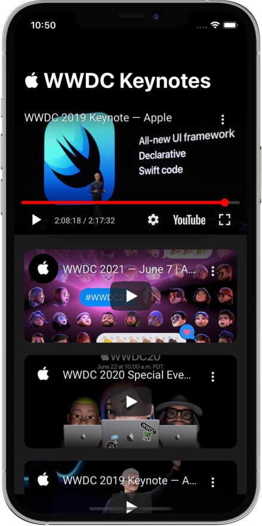

<br/>

<p align="center">
    
</p>

<h1 align="center">
    YouTubePlayerKit
</h1>

<p align="center">
    A Swift Package to easily play YouTube videos.
</p>

<p align="center">
   <a href="https://swiftpackageindex.com/SvenTiigi/YouTubePlayerKit">
    
   </a>
   <a href="https://swiftpackageindex.com/SvenTiigi/YouTubePlayerKit">
    
   </a>
   <br/>
   <a href="https://github.com/SvenTiigi/YouTubePlayerKit/actions/workflows/build_and_test.yml">
       
   </a>
   <a href="https://sventiigi.github.io/YouTubePlayerKit/documentation/youtubeplayerkit/">
       
   </a>
   <a href="https://twitter.com/SvenTiigi/">
      
   </a>
    <a href="https://mastodon.world/@SvenTiigi">
      
   </a>
</p>



```swift
import SwiftUI
import YouTubePlayerKit

struct ContentView: View {

    var body: some View {
        //  WWDC 2019 Keynote
        YouTubePlayerView(
            "https://youtube.com/watch?v=psL_5RIBqnY"
        )
    }

}
```

## Features

- [x] Play YouTube videos with just one line of code 📺
- [x] YouTube [Terms of Service](https://developers.google.com/youtube/terms/api-services-terms-of-service) compliant implementation ✅
- [x] Access to all native YouTube iFrame [APIs](https://developers.google.com/youtube/iframe_api_reference) 👩‍💻👨‍💻
- [x] Support for SwiftUI, UIKit and AppKit 🧑‍🎨
- [x] Runs on iOS, macOS and visionOS 📱 🖥 👓

## Example

Check out the example application to see YouTubePlayerKit in action. Simply open the `Example/Example.xcodeproj` and run the "Example" scheme.

## Installation

To integrate using Apple's [Swift Package Manager](https://swift.org/package-manager/), add the following as a dependency to your `Package.swift`:

```swift
dependencies: [
    .package(url: "https://github.com/SvenTiigi/YouTubePlayerKit.git", from: "2.0.0")
]
```

Or navigate to your Xcode project then select `Swift Packages`, click the “+” icon and search for `YouTubePlayerKit`.

> [!NOTE]
> When integrating YouTubePlayerKit to a macOS or Mac Catalyst target please ensure to enable "Outgoing Connections (Client)" in the "Signing & Capabilities" sections.

## App Store Review

When submitting an app to the App Store which includes the `YouTubePlayerKit`, please ensure to add a link to the [YouTube API Terms of Services](https://developers.google.com/youtube/terms/api-services-terms-of-service) in the review notes.

```
https://developers.google.com/youtube/terms/api-services-terms-of-service
```

## Limitations

- Audio background playback is not supported as it violates the YouTube Terms of Service.
- Simultaneous playback of multiple YouTube players is not supported.
- Controlling playback of [360° videos](https://developers.google.com/youtube/iframe_api_reference#Spherical_Video_Controls) is not supported.

## Usage

> [!TIP]
> Please refer to the [YouTubePlayerKit documentation](https://sventiigi.github.io/YouTubePlayerKit/documentation/youtubeplayerkit/) for a complete overview.

A [`YouTubePlayer`](https://github.com/SvenTiigi/YouTubePlayerKit/blob/main/Sources/YouTubePlayer.swift) can be easily displayed when using `SwiftUI` by declaring a [`YouTubePlayerView`](https://github.com/SvenTiigi/YouTubePlayerKit/blob/main/Sources/UI/View/YouTubePlayerView.swift).

```swift
import SwiftUI
import YouTubePlayerKit

struct ContentView: View {

    let youTubePlayer: YouTubePlayer = "https://youtube.com/watch?v=psL_5RIBqnY"

    var body: some View {
        YouTubePlayerView(self.youTubePlayer) { state in
            // An optional overlay view for the current state of the player
            switch state {
            case .idle:
                ProgressView()
            case .ready:
                EmptyView()
            case .error(let error):
                ContentUnavailableView(
                    "Error",
                    systemImage: "exclamationmark.triangle.fill",
                    description: Text("YouTube player couldn't be loaded: \(error)")
                )
            }
        }
        // Optionally react to specific updates such as the fullscreen state
        .onReceive(
            self.youTubePlayer.fullscreenStatePublisher
        ) { fullscreenState in
            if fullscreenState.isFullscreen {
                // ...
            }
        }
    }

}
```

> [!TIP]
> You can optionally mark the YouTubePlayer with `@StateObject` or `@ObservedObject` to automatically update your view whenever the source, parameters, or isLoggingEnabled change.

When using `UIKit` or `AppKit` you can make use of the [`YouTubePlayerViewController`](https://github.com/SvenTiigi/YouTubePlayerKit/blob/main/Sources/UI/ViewController/YouTubePlayerViewController.swift) or [`YouTubePlayerHostingView`](https://github.com/SvenTiigi/YouTubePlayerKit/blob/main/Sources/UI/HostingView/YouTubePlayerHostingView.swift).

```swift
import UIKit
import YouTubePlayerKit

let youTubePlayerViewController = YouTubePlayerViewController(
    player: "https://youtube.com/watch?v=psL_5RIBqnY"
)

let youTubePlayerHostingView = YouTubePlayerHostingView(
    player: "https://youtube.com/watch?v=psL_5RIBqnY"
)

// Access the player on both instances via the `.player` property
// Example: youTubePlayerViewController.player
```

## YouTubePlayer

A [`YouTubePlayer`](https://github.com/SvenTiigi/YouTubePlayerKit/blob/main/Sources/YouTubePlayer.swift) is the central object in order to play a certain YouTube video and interact with the underlying YouTube iFrame API.

As seen in the previous examples you can initialize a player by using a string literal:

```swift
let youTubePlayer: YouTubePlayer = "https://youtube.com/watch?v=psL_5RIBqnY"
```

To take full control you can initialize a [`YouTubePlayer`](https://github.com/SvenTiigi/YouTubePlayerKit/blob/main/Sources/YouTubePlayer.swift) with a [`YouTubePlayer.Source`](https://github.com/SvenTiigi/YouTubePlayerKit/blob/main/Sources/Models/YouTubePlayer%2BSource.swift), [`YouTubePlayer.Parameters`](https://github.com/SvenTiigi/YouTubePlayerKit/blob/main/Sources/Models/YouTubePlayer%2BParameters.swift) and a [`YouTubePlayer.Configuration`](https://github.com/SvenTiigi/YouTubePlayerKit/blob/main/Sources/Models/YouTubePlayer%2BConfiguration.swift)

```swift
let youTubePlayer = YouTubePlayer(
    // Possible values: .video, .videos, .playlist, .channel
    source: .video(id: "psL_5RIBqnY"),
    // The parameters of the player
    parameters: .init(
        autoPlay: true,
        loopEnabled: true,
        startTime: .init(value: 5, unit: .minutes),
        showControls: true,
        // ...
    ),
    // The configuration of the underlying web view
    configuration: .init(
        fullscreenMode: .system,
        allowsInlineMediaPlayback: true,
        customUserAgent: "MyCustomUserAgent",
        // ...
    )
)
```

To differentiate between parameters and configuration, understand that parameters control the behavior and style of the YouTube player, while the configuration is linked to the underlying web view.
You cannot modify the configuration after instantiation; however, it is possible to update the parameters, as shown below:

```swift
youTubePlayer.parameters.showControls = false
```

> [!WARNING]
> Updating the [`YouTubePlayer.Parameters`](https://github.com/SvenTiigi/YouTubePlayerKit/blob/main/Sources/Models/YouTubePlayer%2BParameters.swift) during runtime will cause the player to reload.

### Source

The [`YouTubePlayer.Source`](https://github.com/SvenTiigi/YouTubePlayerKit/blob/main/Sources/Models/YouTubePlayer%2BSource.swift) is an enum which allows you to specify which YouTube source should be loaded/cued.

```swift
// A single video
let video: YouTubePlayer.Source = .video(id: "psL_5RIBqnY")

// Series of videos
let videos: YouTubePlayer.Source = .videos(ids: ["w87fOAG8fjk", "RXeOiIDNNek", "psL_5RIBqnY"])

// Playlist
let playlist: YouTubePlayer.Source = .playlist(id: "PLHFlHpPjgk72Si7r1kLGt1_aD3aJDu092")

// Channel
let channel: YouTubePlayer.Source = .channel(name: "GoogleDevelopers")
```

You can also use a URL to initialize a source.

```swift
let source: YouTubePlayer.Source? = .init(urlString: "https://youtube.com/watch?v=psL_5RIBqnY")
```

> [!NOTE]
> The URL parsing logic is designed to handle most known YouTube URL formats, but there may be some variations that it doesn't cover.

### API

A [`YouTubePlayer`](https://github.com/SvenTiigi/YouTubePlayerKit/blob/main/Sources/YouTubePlayer.swift) lets you access the underlying [YouTube Player iFrame API](https://developers.google.com/youtube/iframe_api_reference) to play, pause, seek, retrieve video information and much more.

The majority of the APIs are `async` and `throwable` functions.

```swift
// Pauses the currently playing video
try await youTubePlayer.pause()
```

> [!TIP]
> Please see the [documentation](https://sventiigi.github.io/YouTubePlayerKit/documentation/youtubeplayerkit/youtubeplayer) for a full overview of the available APIs.

In case of an error, most functions throw a [`YouTubePlayer.APIError`](https://github.com/SvenTiigi/YouTubePlayerKit/blob/main/Sources/Models/Error/YouTubePlayer%2BAPIError.swift).
This allows you to easily examine the reason for the error, any underlying error, and the executed JavaScript along with its response.

```swift
do {
    try await youTubePlayer.setCaptions(fontSize: .small)
} catch {
    print(
        "Failed to set captions font size",
        error.reason,
        error.underlyingError,
        error.javaScript,
        error.javaScriptResponse
    )
}
```

Additionally, several Publishers are available to react to changes of the player:

```swift
// Observe playback metadata
let cancellable = youTubePlayer
    .playbackMetadataPublisher
    .sink { playbackMetadata in
        // ...
    }
```

## Video Thumbnail

You can load a YouTube video thumbnail via the [`YouTubeVideoThumbnail`](https://github.com/SvenTiigi/YouTubePlayerKit/blob/main/Sources/VideoThumbnail/YouTubeVideoThumbnail.swift) object.

```swift
// Initialize an instance of YouTubeVideoThumbnail
let videoThumbnail = YouTubeVideoThumbnail(
    videoID: "psL_5RIBqnY",
    // Choose between default, medium, high, standard, maximum
    resolution: .high
)

// Retrieve the URL, if available
let url: URL? = videoThumbnail.url

// Retrieve the image, if available.
let image: YouTubeVideoThumbnail.Image? = try await videoThumbnail.image()
```

Additionally, the player allows you to easily retrieve the thumbnail url and image for the currently loaded video.

```swift
// Returns the video thumbnail URL of the currently loaded video
try await youTubePlayer.getVideoThumbnailURL()

/// Returns the video thumbnail of the currently loaded video
try await youTubePlayer.getVideoThumbnailImage(resolution: .maximum)
```

## Logging

If you wish to gain more insights into the underlying communication of the YouTube Player iFrame JavaScript API, you can enable the logging of a player via the `isLogginEnabled` parameter.

The [`YouTubePlayer`](https://github.com/SvenTiigi/YouTubePlayerKit/blob/main/Sources/YouTubePlayer.swift) utilizes the [unified logging system (OSLog)](https://developer.apple.com/documentation/os/logging) to log information about the player options, JavaScript events and evaluations.

```swift
// Enable or disable logging during initialization
let youTubePlayer = YouTubePlayer(
    source: [
        "w87fOAG8fjk",
        "RXeOiIDNNek",
        "psL_5RIBqnY"
    ],
    isLoggingEnabled: true
)

// To update during runtime update the isLoggingEnabled property
youTubePlayer.isLoggingEnabled = false

// Additionally, you can retrieve an instance of the logger if logging is enabled.
let logger: Logger? = youTubePlayer.logger()
```

## Advanced

You can observe the incoming stream of [`YouTubePlayer.Event`](https://github.com/SvenTiigi/YouTubePlayerKit/blob/main/Sources/Models/Event/YouTubePlayer%2BEvent.swift) from the underlying YouTube Player iFrame API through the following publisher.

```swift
let cancellable = youTubePlayer
    .eventPublisher
    .sink { event in
        switch event.name {
        case .playbackQualityChange:
            break
        case .autoplayBlocked:
            break
        default:
            break
        }
    }
```

> [!IMPORTANT]
> The YouTubePlayerKit supports both official as well as unofficial/undocumented events. Please see the [`YouTubePlayer.Event.Name`](https://github.com/SvenTiigi/YouTubePlayerKit/blob/main/Sources/Models/Event/YouTubePlayer%2BEvent%2BName.swift) enumeration for more details.

To run [custom JavaScript](https://github.com/SvenTiigi/YouTubePlayerKit/blob/main/Sources/Models/JavaScript/YouTubePlayer%2BJavaScript.swift) on the YouTube player JavaScript instance:

```swift
try await youTubePlayer.evaluate(
    javaScript: "\(.youTubePlayer).play()"
)
```

> [!NOTE]
> The custom string interpolation of [`\(.youTubePlayer)`](https://github.com/SvenTiigi/YouTubePlayerKit/blob/main/Sources/Models/JavaScript/YouTubePlayer%2BJavaScript.swift) is a placeholder for the YouTube player JavaScript variable.

Alternatively, you can use the following convenience function to directly invoke a function on the YouTube player JavaScript object:

```swift
try await youTubePlayer.evaluate(
    javaScript: .youTubePlayer(
        functionName: "setLoop",
        parameters: [
            true
        ]
    )
)
```

If you wish to further customize the underlying HTML you can configure the [`YouTubePlayer.HTMLBuilder`](https://github.com/SvenTiigi/YouTubePlayerKit/blob/main/Sources/Models/YouTubePlayer%2BHTMLBuilder.swift) when initializing an instance of the player:

```swift
let youTubePlayer = YouTubePlayer(
    source: .video(id: "psL_5RIBqnY"),
    configuration: .init(
        htmlBuilder: .init(
            youTubePlayerJavaScriptVariableName: "youtubePlayer",
            youTubePlayerEventCallbackURLScheme: "youtubeplayer",
            youTubePlayerEventCallbackDataParameterName: "data",
            youTubePlayerIframeAPISourceURL: .init(string: "https://www.youtube.com/iframe_api")!,
            htmlProvider: { htmlBuilder, jsonEncodedYouTubePlayerOptions in
                // TODO: Return custom HTML string
            }
        )
    )
)
```

## Credits

- [youtube/youtube-ios-player-helper](https://github.com/youtube/youtube-ios-player-helper)
